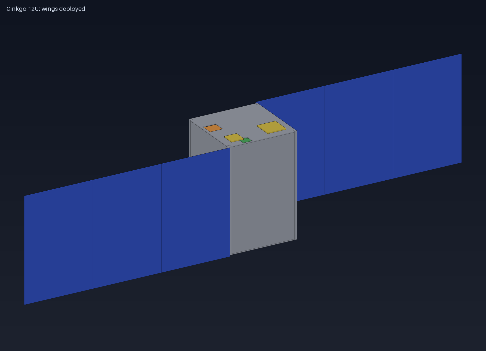
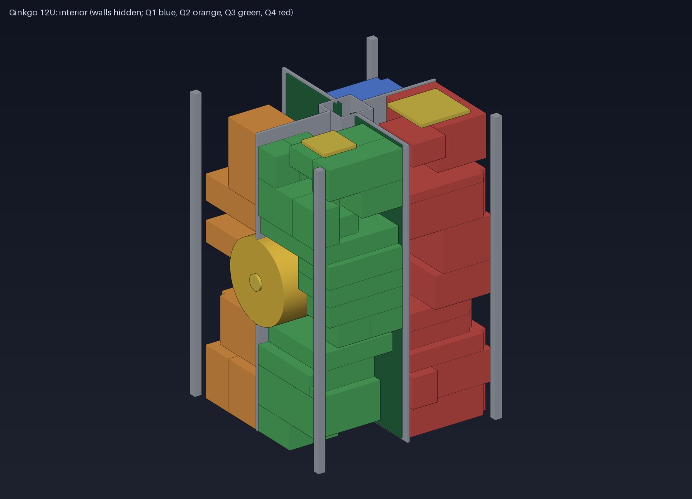

# Wollemi system design document (generated)

Generated by `python tools/gen_sdd.py` on 2026-09-27 11:46 UTC; numbers are read from the configs and tools, the decision log is hand-written. Everything is an engineering estimate at the current design level (no hardware exists); see `docs/risks.md` and the open items at the end.

## 1. Purpose and document map

This is the single overview of the design. Details live in the documents below.

| Topic | Document |
|---|---|
| Plan and status | `docs/plan.md`, `docs/status.md` |
| Requirements and verification | `mission/requirements.md`, `docs/verification-matrix.md`, `docs/test-plan.md` |
| Architecture, layout, mechanical | `docs/architecture.md`, `docs/layout.md`, `mechanical/README.md`, `docs/structure.md`, `docs/icd.md` |
| Power, thermal, propulsion, attitude | `docs/power-architecture.md`, `docs/eps-card.md`, `docs/thermal.md`, `docs/propulsion.md`, `docs/adcs.md` |
| Electronics | `docs/electrical-interface.md`, `electronics/README.md` |
| Software and data | `docs/firmware-architecture.md`, `docs/protocol.md`, `docs/data-plan.md`, `firmware/README.md` |
| Orbit, longevity, safety | `docs/orbit-and-debris.md`, `docs/longevity.md`, `docs/fmea.md`, `docs/risks.md` |
| Operations and ground | `docs/ops-concept.md`, `docs/ground-station-kit.md`, `docs/mission-simulation.md` |
| Context | `docs/prior-art.md`, `docs/design-identity.md`, `docs/decisions/`, `docs/outreach-led.md`, `docs/cost.md` |

## 2. Mission

A 12U open, long-life science observatory and reusable platform (objectives OBJ-1 to OBJ-5 in `mission/requirements.md`): multi-decade space-weather and radiation records, 5 m class imaging and hyperspectral scenes, reliability science on COTS compute and flash memory, an open ground kit and archive, and a design others can reuse.

## 3. Configuration and budgets (live)

| Item | Value |
|---|---|
| Form factor | 12U, 226.3 x 226.3 x 340.5 mm |
| Mass | 16.75 kg of 24 kg (12.3 kg bus, 4.3 kg science, 0.09 kg outreach) |
| Modules | 48 placed in the cell grid, 0 interferences; module volume 10210 cm3 of 10740 cm3 usable (science 52 %) |
| Centre of mass | (-5.8, -7.3, +10.8) mm; inertia (0.198, 0.188, 0.139) kg m2 stowed |
| Average load (full) | 20.4 W; batteries 84 Wh (2 x 42 Wh) plus 5 Wh survival pack |
| Figures of merit | FOM-1 4.85 W/U, FOM-2 x2.7 eclipse margin, FOM-3 26 % science mass, FOM-4 52 % science volume |

Power scenarios (orbit average):

| Scenario | Generation W | Load W | Margin | Eclipse need Wh |
|---|---|---|---|---|
| Typical LEO, ADCS sun-biased (NOMINAL) | 58.2 | 20.4 | +186 % | 12.2 |
| Typical LEO, tumbling, wings deployed | 27.8 | 20.4 | +36 % | 12.2 |
| Dawn-dusk SSO, nadir pointing, wings face sun | 122.2 | 20.4 | +500 % | 0.6 |
| SAFE MODE: tumbling, wings failed to deploy | 10.9 | 3.1 | +251 % | 1.9 |
| BURN MODE: minimal services + electric thruster (sunlit only) | 58.2 | 53.1 | +77 % | 1.9 |

## 4. Subsystem summaries

**Structure.** Al 6061 frame with corner rails, four columns around a 40 mm spine, notched Wollemi cards; first mode about 900 Hz (frame), 170 Hz walls, 190 Hz wing stack with six hold-down posts; all mounts >= 6x margin (`docs/structure.md`).

**Power.** Two wings of three double-sided panels plus body cells; two independent EPS chains (three buck MPPT channels each), two LiFePO4 packs and an independent survival chain; per-card eFuse and hardware kill (`docs/power-architecture.md`, `docs/eps-card.md`).

**Thermal.** Passive design with effective face emissivity ~0.5, isolated telescope column with an 8 W thermostat heater, battery vault heater, survival heaters; electronics -10..33 C, battery 4..15 C (`docs/thermal.md`).

**Attitude and propulsion.** Three reaction wheels, magnetorquers, star tracker; iodine gridded-ion thruster in a bay on the -X centre line with a canted nozzle through the centre of mass; about 570 m/s available, 187 m/s planned (`sim/orbit_life.py`); drag sail (`docs/adcs.md`, `docs/propulsion.md`).

**Compute and firmware.** MSP430FR supervisor, two STM32H7 flight controllers, mass memory unit (8 x 128 GB, 6+2 coding), Pi CM5 and Jetson Orin Nano; host-tested firmware core (auth, modes, FDIR, command queue, OTA), 68 unit checks (`docs/firmware-architecture.md`).

**Communications and protocol.** UHF beacon and LoRa, S-band 250 kbps - 2 Mbps; CCSDS packets with signed telecommands, 27 messages, generated C and Python code with byte-exact tests (`docs/protocol.md`).

**Payload suite.** Telescope with hyperspectral spectrometer, wide-field camera, thermal IR, magnetometer boom, particle spectrometer, X-ray/UV, TSI, GRB, VLF, Langmuir, dosimeter, CSAC, GNSS/TEC, flash and SEU experiments, retroreflector, memory plate, outreach LED (`docs/data-plan.md`).

**Electronics interface.** Notched 100 x 100 mm card, WL-P (2 x 30) and WL-D (2 x 15) connectors at 1.27 mm, passive 15-slot backplane strip per column (KiCad, DRC clean), CANopen-style management over CAN-FD A/B (`docs/electrical-interface.md`).

**Ground and operations.** Reference station at Pamukkale (3.7 passes/day, unattended operation needed), open S-band kit, contact plan tool, commissioning checklist (`docs/ops-concept.md`, `docs/ground-station-kit.md`).

## 5. Decision log (what analysis changed)

| # | Decision | Reason | Triggered by |
|---|---|---|---|
| 1 | 12U form factor, standard CubeSat rails | Sponsors and rideshare providers can only launch what fits a standard dispenser; 12U gave the volume for a science-first payload. | Volume review (6U did not fit: core alone was 159 % of usable volume). |
| 2 | Science-first allocation; hyperspectral shares the telescope optics | Science value drove the payload ranking; sharing the fore-optics saved about 400 cm3. | Volume budget. |
| 3 | Tiered lifetime instead of one 50-year claim | COTS compute and batteries cannot last 50 years; the survival chain and the long-life science chain can. | Longevity analysis (dose, battery cycles). |
| 4 | Long-life science never depends on Linux nodes | Multi-decade records must survive the loss of Jetson and Pi. | Longevity analysis; firmware architecture rule. |
| 5 | Three isolated power paths (A, B, survival C); per-card hardware eFuse, hardware kill | A single fault must not take down the spacecraft; protection must not depend on software. | Power architecture; backplane routing study. |
| 6 | LiFePO4 2S2P 26650 packs (42 Wh each), separated vaults, no wood | Safest lithium chemistry; wood outgasses; real cell data showed 440 g per pack, not 300 g. | EPS design calculation. |
| 7 | Electric iodine propulsion replaced the water resistojet | 12-15x the delta-v for similar volume; enables 50-year station keeping and controlled descent. | Delta-v budget. |
| 8 | Propulsion bay on the -X face centre line with a canted nozzle | A column-mounted nozzle sat ~70 mm from the centre of mass (70 uN m per mN): wheels saturate in minutes; canting also keeps the plume off wing B. | ADCS analysis + CAD geometry. |
| 9 | 1.7 kg tungsten trim ballast | The centre of mass had crept to -18.7 mm in y against a +-20 mm dispenser limit. | CAD mass properties (ICD generation). |
| 10 | Wings must be double-sided; six hold-down posts per wing stack | With the sun on the orbit normal, a single-sided wing faces away; the stowed panel resonated at 99 Hz. | Power scenario review; structural analysis. |
| 11 | Effective face emissivity about 0.5, isolated and heated telescope column, survival heaters | The spacecraft runs cold, not hot: 27 C below the limit with radiator-like faces; the telescope column overheated in sunlit dawn-dusk orbits. | Thermal model. |
| 12 | Wollemi card: 100 x 100 mm with a 20 mm spine notch, 8 mm outer relief, 4 mm backplane gap, 1.27 mm connector pitch | 90 x 90 and 100 x 100 boards could not clear the spine; 0.8 mm pitch could not be routed on the backplane. | Geometric packing; backplane DRC. |
| 13 | Round telescope tube of about 85 mm aperture | A square 100 mm box does not fit around the spine; only a round tube does. | Geometric packing. |
| 14 | OreSat compatibility: CANopen conventions, own connector | Reuse tooling and credit the closest precedent without inheriting a 1U-3U constraint. | Prior-art review. |
| 15 | SCIENCE_LITE mode on the Pi CM5 | The mission simulation showed that imaging stopped forever after a Jetson failure. | Closed-loop mission simulation. |
| 16 | Dawn-dusk sun-synchronous orbit preferred | No eclipse (batteries, thermal swings), best power and burn geometry; fixed wings face the sun. | Power, thermal, ADCS analyses. |
| 17 | Drag sail is required, propulsion descent recommended | From 700 km the sail alone takes 14-20 years on this model, without it 45-50 years. | Orbit lifetime analysis. |
| 18 | Ed25519-signed telecommands, no encryption on the air | Amateur-band rules forbid obscuring meaning; signatures stop forgery and replay. | Protocol design. |
| 19 | FOM-2 and FOM-3 redefined | Wh/U rewarded unused battery; mass spent on safety and longevity is deliberate. | Requirements refresh. |

## 6. Analysis and verification status

- Automatic regression: **22 of 22 checks pass.** (`docs/status.md`).
- Requirements: **47 requirements: 30 PASS (automatic), 0 FAIL, 9 designed but not proven, 8 open.**
- Test plan: 29 planned activities cover the requirements; about 780 engineer-days (`docs/test-plan.md`). No physical test has been done: everything above is analysis and simulation.

## 7. Risks, cost and schedule

Top risks (score = likelihood x impact, `docs/risks.md`):

- **R1** (20): **No launch opportunity or sponsor** (12U rideshare, orbit >= 700 km, cost)
- **R2** (20): **Operator of record, frequency coordination and licensing** not in place (amateur bands, IARU, national authority)
- **R3** (20): **Single-person project scope** (5 processors, 26 instruments, firmware, ground)
- **R4** (20): **Cost** far beyond a hobby budget (cells, thruster, optics, tests)
- **R5** (12): **Double-sided thin wing panels (2.1 mm)** may not meet stiffness, mass or cost (PWR-5)
- **R6** (12): **Residual magnetic dipole > 0.1 A m2** compromises the magnetometer and control

Rough cash cost (USD, unverified +-2x, `docs/cost.md`): Precursor: FlatSat + balloon flight (no launch, no flight-only hardware): P50 0.84 M; Core flight (bus + long-life science chain, no imaging): P50 3.9 M; Full flight (imaging, hyperspectral, extras): P50 4.5 M. Schedule about 4.5 years to launch at the median.

## 8. Open items and decisions for the operator

1. Choose the target: a flight mission, a flight-quality reference design, or the precursor path (FlatSat + balloon); this decides effort and cost by an order of magnitude. *Recommendation (not a decision the design can make): the precursor path first, since it retires the most risk per dollar and keeps the flight-vs-reference choice open until after it.*
2. Confirm the preferred orbit (dawn-dusk sun-synchronous, about 700 km) and whether the outreach LED stays in the flight configuration. *Recommendation: dawn-dusk is favoured on this analysis for thermal, power and battery-life reasons (`docs/orbit-and-debris.md`, `docs/thermal.md`, `docs/longevity.md`) and is the working assumption throughout; the LED is a purely aesthetic choice for the operator, not an engineering one -- the corrected physics (`docs/outreach-led.md`) now shows a blue+violet combination gives both a naked-eye-visible flash and a camera beacon at only 10 W, so cost is no longer a reason against it either way.*
3. Get vendor quotes and datasheets for the thruster, cells, optics and launch; replace estimates and module envelopes.
4. Detailed design still missing: EPS and other schematics, vendor CAD, boom and antenna mechanisms, umbilical and separation switches, finite-element model, thermal detail model.
5. Prior-art and patent search, trademark check for the name, licences and public release (`docs/licensing.md`). *Update: the project was renamed from "Ginkgo" to "Wollemi" after finding that "GINKGO" was a live US trademark (Ginkgo Bioworks, covering computer hardware/software design services) and that a same-named unrelated open-source HPC library already existed; an initial check found no such conflict for "Wollemi", but a full legal clearance search is still needed before any public release (`docs/licensing.md`). Making the repository public is the operator's decision to make and to act on, not something to be done automatically here.*
6. Partners: a licensed operator organisation, a launch sponsor or programme, test facilities.
7. The 50-year design life versus the 25-year disposal guideline (`LONG-4`, `docs/orbit-and-debris.md`): documented here as "the 50-year figure is a platform design life; the operational life of any one flight ends with a disposal manoeuvre inside the guideline (or a documented exception)" -- flagged for the operator to confirm or override, since it affects how the mission is described publicly.
